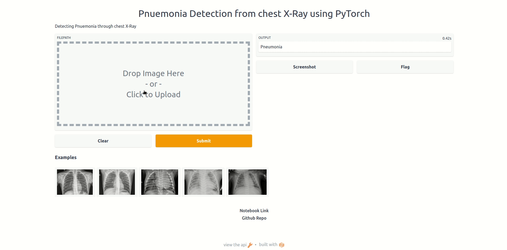

# Pneumonia Detection

### Detecting Pneumonia from chest X-Ray images using PyTorch.
The model architecture used is [resnet18](https://arxiv.org/pdf/1512.03385) which is trained using PyTorch, and then converted to ONNX format for deployment using Heroku.

## Dataset 📂
Dataset used for training is from Kaggle [Chest X-Ray Dataset](https://www.kaggle.com/paultimothymooney/chest-xray-pneumonia) which which contains over 5800 samples obtained from The Guangzhou Women and Children’s Medical Center. 

## Notebook 📒
View the notebook here: [pneumonia-det.ipynb](https://nbviewer.org/github/kingjuno/Pneumonia-Detection/blob/master/notebook/pneumonia-det.ipynb)

## Deployment 🚀
The model has been been converted to ONNX format and deployed using Gradio & hosted on Heroku: [Pneumonia Detection using chest X-Ray](https://pneuomnia-detection.herokuapp.com/)

## Predictions 🔍
Predictions on unseen test data:

